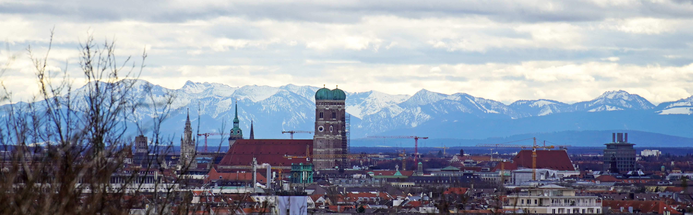

  

    <h1 class="text-body-emphasis text-center">Venue</h1>
    

RISC-V Summit Europe 2024 will take place the MOC conference in the north of Munich.
    

    

    The venue can be reached by subway U6 and a short walk. The subway crosses the city center with the stations "Sendlinger Tor", "Marienplatz", "Odeonsplatz" and "Münchener Freiheit". Signage will show the way from the subway station to the venue.
    

<iframe src="https://www.google.com/maps/embed?pb=!1m18!1m12!1m3!1d57365.356826564464!2d11.542219843928848!3d48.16424897070057!2m3!1f0!2f0!3f0!3m2!1i1024!2i768!4f13.1!3m3!1m2!1s0x479e746f1a4cd0d3%3A0xe3acdad171be6854!2sMOC%20%E2%80%93%20Event%20Center%20Messe%20Munich!5e0!3m2!1sen!2sde!4v1698259650300!5m2!1sen!2sde" width="100%" height="450" style="border:0;" allowfullscreen="" loading="lazy" referrerpolicy="no-referrer-when-downgrade"></iframe>

  

  

    <h1 class="text-body-emphasis text-center">Accomodation</h1>
    

        There are plenty of accomodation options in Munich.
    

    

      There is a hotel in the upper price class directly opposite the venue: [Ameron Munich Motorworld](https://ameroncollection.com/de/muenchen-motorworld).
    

    

    The majority of hotels are in the city center. Along the subway line there are affordable hotels north of Sendlinger Tor (towards the main station).
    

  

