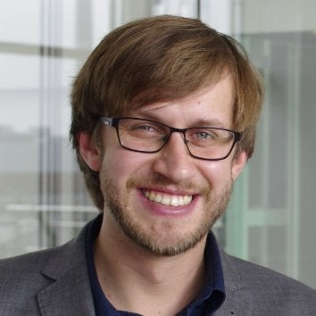
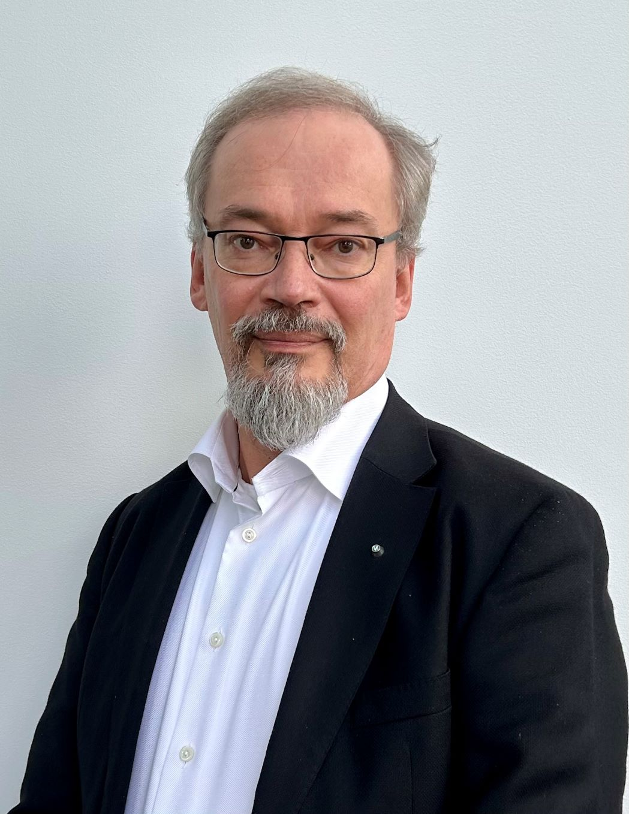





[RISC-V](https://riscv.org), the open standard [instruction set
architecture
(ISA)](https://en.wikipedia.org/wiki/Instruction_set_architecture), is
enabling a range of new applications and research that will define the
future of computing in Europe. The region has been central to RISC-V's
success, with one-third of RISC-V's global community based in Europe.

**RISC-V Summit Europe** takes place in **Paris** from **Monday 12th to
Thursday 15th May, 2025**. The combination of strong industrial and
academic communities is key to the success of RISC-V in Europe, and
for this reason the conference is designed to help attendees to
explore both commercial and research applications.  *RISC-V Summit
Europe* is an opportunity not to be missed. Come to Paris to be part
of the new wave of European computing innovation!





  

    

      

        
      

    

    

      

        

          <h5 class="mt-4 font-weight-medium mb-1"><b>Stefan Wallentowitz</b> Munich University of Applied Sciences</h5>
          <h6 class="subtitle">Professor</h6>
        

      

    

  

  

    

      

        
      

    

    

      

        

          <h5 class="mt-4 font-weight-medium mb-1"><b>Krste Asanović</b> SiFive</h5>
          <h6 class="subtitle">Chief Architect</h6>
        

      

    

  

  

    

      

        
      

    

    

      

        

          <h5 class="mt-4 font-weight-medium mb-1"><b>Jari Kinaret</b> Chips JU</h5>
          <h6 class="subtitle">Executive Director</h6>
        

      

    

  





<table class="table">
  <tr>
    <td style="width: 25%"><b>Monday, May 12</b></td>
    <td><b><i>Member and Newcomer Day</i></b> Tutorials for Newcomers, Hackathon for Students, Technical Workgroup
      Meetings (members only)
	    Venue: <a href="https://maps.app.goo.gl/Q31cnRLcnvaRXa6v9"><em>La Cité des Sciences et de l'Industrie,</em> Porte de la Villette, Paris</a>.
	  <!--  <a href="twgs"><b>Learn more</b></a> -->
	  </td>
  </tr>
  <tr>
    <td><b>Tuesday, May 13 to  Thurday, May 15</b></td>
    <td><b><i>Main Conference Program</i></b> Keynotes, Plenary Presentations, Panels, Demo Theatre, Expo,
      Posters
	    Venue: <a href="https://maps.app.goo.gl/Q31cnRLcnvaRXa6v9"><em>La Cité des Sciences et de l'Industrie,</em> Porte de la Villette, Paris</a>.
	  <!--  <a href="conference"><b>Learn more</b></a> -->
	  </td>
  </tr>
  <tr>
    <td><b>Friday, May 16</b></td>
	<td><b><i>Side Events & Workshops</i></b> 
	Side events, such as projects meetings and workshops, can be
	organized on Friday, May 16th. However, they will be
	coordinated and hosted by INRIA this year, on their Paris premises.
	 <a href="side-events"><b>Learn more</b></a> &mdash; Venue: <a href="https://maps.app.goo.gl/4aLjAxVuKkJU7WbL7"><em>INRIA Paris</em>, 48 rue Barrault, Paris</a>.</td>
  </tr>
</table>


