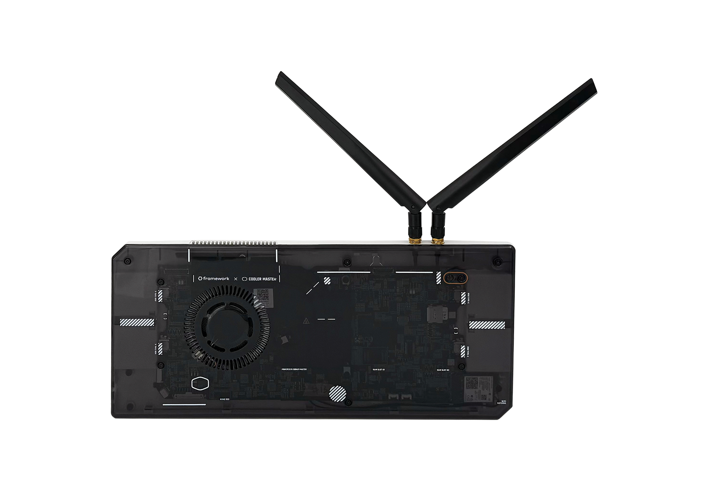
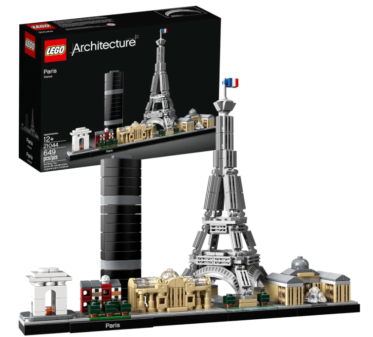





- [The Welcome Networking Reception](#Cocktail), Thursday 13 from
  18:00&ndash;20:30 at the expo area (S1 & S2).
- [The Deep Computing Reception](#DeepComputing), Wednesday 14
  evening, from 18:00&ndash;20:00, at the expo area (S1 & S2).
- [The Planetarium sessions](#Planetarium), Wednesday 14 evening,
  between 18:00&ndash;20:00 at the
  [Planetarium](https://www.cite-sciences.fr/en/planetarium).
- [The Summit 2025 Social Event](#Social), Wednesday 14 evening, from
  20:00&ndash;23:00 at the **Forum**, upstairs from the Summit.





Enjoy beverages and light bites, while networking with exhibitors and
attendees.





Between 18:00&ndash;20:00, on Wednesday:

 - DeepComputing wikk raffle <a
   href="https://deepcomputing.io/product/dc-roma-risc-v-mainboard/">DC-ROMA
   RISC-V Mainboard</a>!
 - While RISC-V International will raffle a set of lego!

Raffle Tickets are available at the DeepComputing & RISC-V booths.

  

	
  

  

	
 





With its high-resolution projection equipment, the Cité's
[Planetarium](https://www.cite-sciences.fr/en/planetarium) will take
you on a thrilling journey to the outer reaches of the
universe. Surrounded by 360° computer-generated images, not only will
you learn more, you'll also feel as if you really are in space! A
spectacular immersive experience.

Details will be provided during the Summit.





*Last, but not least&hellip;* join us Wednesday evening for a special
night of networking, cocktails, and a buffet dinner, set at the
**Forum**, against the backdrop of open museum exhibits'


