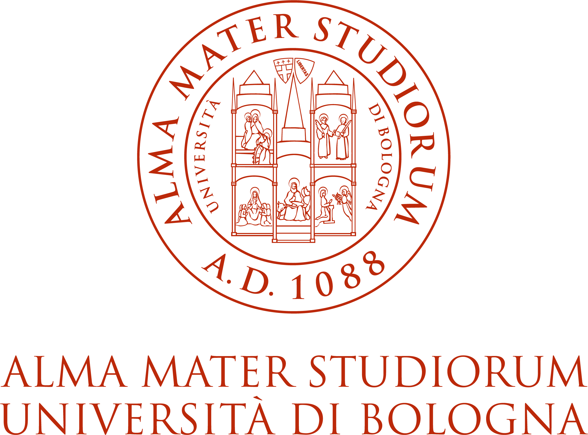





Learn more about the people behind RISC-V Summit Europe.

### The Summit

The three previous editions of the RISC-V Summit Europe were:
- [12-15 May 2025, Paris](https://riscv-europe.org/summit/2025).
- [24-28 June 2024, Munich](https://riscv-europe.org/summit/2024).
- [5-9 June 2023, Barcelona](https://riscv-europe.org/summit/2023).

The RISC-V Summit Europe Series started as a merger of three previous
European events series, joined by [RISC-V
International](https://riscv.org):

- Red-RISC-V in Spain: [http://red-riscv.org](http://red-riscv.org)
- RISC-V Week in France: [https://open-src-soc.org/2022-05](https://open-src-soc.org/2022-05)
- Workshop on RISC-V activities in Germany: [https://www.edacentrum.de/en/risc-v](https://www.edacentrum.de/en/risc-v)

### The Program Committee

- Xu An (Beijing Institute of Open Source Chip)
- Jan Andersson Nerén (Frontgrade Gaisler)
- Hassan Ashraf (10xEngineers)
- Jeremy Bennett (Embecosm)
- Nicolas Brunie (SiFive)
- Ramon Canal (Universitat Politècnica de Catalunya)
- Adrián Castelló (Universitat Politècnica de València)
- Kashyap Chamarthy (Red Hat)
- George Christou (Technical University of Crete)
- Pasquale Davide Schiavone (OpenHW Group, Eclipse Foundation)
- Fabio De Ambroggi (STMicroelectronics)
- Andy Dellow (Qualcomm)
- Ruud Derwig (Synopsys)
- Julie Dumas (Grenoble INP)
- César Fuguet (INRIA)
- Andrea Gallo (RISC-V International)
- Angelo Garofalo (Università di Bologna)
- Daniel Große (Johannes Kepler Universität Linz) PC Co-Chair
- Fatma Jebali (CEA)
- Eyck Jentzsch (MINRES Technologies)
- Nick Kossifidis (Foundation for Research and Technology - Hellas) PC Chair
- Leonidas Kosmidis (Barcelona Supercomputing Center)
- Fabrizio Magugliani (E4 Computer Engineeering)
- Manolis Marazakis (Foundation for Research and Technology - Hellas)
- Andreas Mauderer (Bosch)
- Daniel Mueller-Gritschneder (TU Wien)
- Katzalin Olcoz (Universidad Complutense de Madrid)
- Arthur Perais (CNRS)
- Borja Perez (Universidad de Cantabria), PC Co-Chair
- Sandro Pinto (Universidade do Minho)
- Jérôme Quévremont (Thales R&T)
- Thomas Roecker (Infineon Technologies )
- Davide Rossi (Università di Bologna)
- Fatima Saleem (10xEngineers)
- Olivier Savry (CEA)
- Olivier Sentieys (INRIA)
- Darshak Sheladiya (Sysgo)
- Gabriel Somlo (Carnegie Mellon University)
- Philipp Tomsich (VRULL)
- Wei Wu (University of Chinese Academy of Sciences)
- Florian Zaruba (Axelera AI)

### The Steering Committee

- Teresa Cervero (BSC), Chair
- Romain Dolbeau (SiPearl)
- Christian Fabre (CEA)
- Frank K. Gürkaynak (ETH Zürich)
- Nick Kossifidis (FORTH)
- Daniel Mueller-Gritschneder (TU Wien)
- Borja Pérez Pavon (Univ. de Cantabria)
- Jérôme Quévremont (Thales R&T)
- Anna Riverola (SiPearl)
- Olivier Sentieys (INRIA)
- Philipp Tomsich (VRULL)
- Stefan Wallentowitz (Hochschule München University of Applied Sciences)

### The Local Organization Committee

- Andrea Bartolini (Unibo), Local Chair
- Teresa Cervero (BSC), as 2023 Local Organizer
- Christian Fabre (CEA), as 2025 Local Organizer
- Frank K. Gürkaynak (ETH Zürich)
- Fabrizio Magugliani (E4)
- Andy Moore (RISC-V International)
- Daniel Mueller-Gritschneder (TU Wien)
- Davide Rossi (University of Bologna)
- Lori Servin (RISC-V International)
- Stefan Wallentowitz (Munich University of Applied Sciences), as 2024 Local Organizer

### The Organizers

The event is organized by [RISC-V International](https://riscv.org),
[Unibo](https://www.unibo.it/en/), and
[Planning](https://planning.it).

    
	&nbsp;
    
	&nbsp;
    


